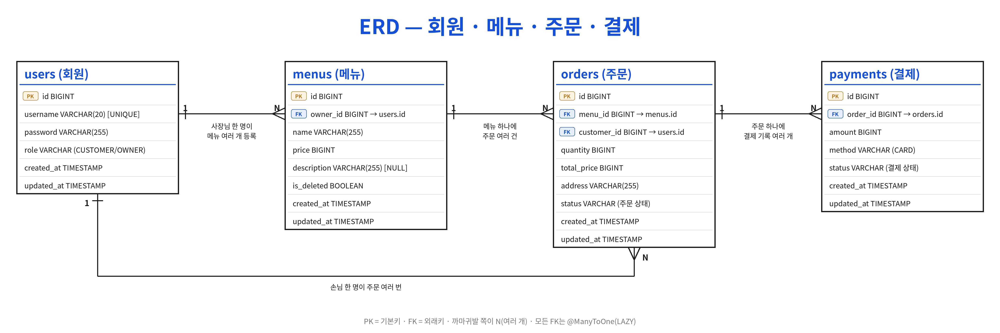

# ERD

원본: [erd.dbml](erd.dbml)

## 테이블 명세서

### users (회원)

| 컬럼 | 타입 | 제약 | 설명 |
| --- | --- | --- | --- |
| `id` | BIGINT | PK, 자동 증가 | 회원 번호 |
| `username` | VARCHAR(20) | NOT NULL, UNIQUE | 아이디 (4~20자, DTO에서 검증) |
| `password` | VARCHAR(255) | NOT NULL | BCrypt 해시 |
| `role` | VARCHAR | NOT NULL | 역할: `CUSTOMER`, `OWNER` (문자열 저장) |
| `created_at` | TIMESTAMP | NOT NULL | 생성 시각 (JPA Auditing) |
| `updated_at` | TIMESTAMP | NOT NULL | 수정 시각 (JPA Auditing) |

### menus (메뉴)

| 컬럼 | 타입 | 제약 | 설명 |
| --- | --- | --- | --- |
| `id` | BIGINT | PK, 자동 증가 | 메뉴 번호 |
| `owner_id` | BIGINT | NOT NULL, FK → `users(id)` | 메뉴를 등록한 사장님 (요청 본문이 아니라 토큰에서 꺼냄) |
| `name` | VARCHAR(255) | NOT NULL | 메뉴 이름 |
| `price` | BIGINT | NOT NULL | 가격 (1원 이상, DTO에서 검증) |
| `description` | VARCHAR(255) | NULL 허용 | 메뉴 설명 (선택 입력) |
| `is_deleted` | BOOLEAN | NOT NULL, DEFAULT false | 삭제 여부 (Soft Delete). true면 목록에서 제외, 단건·수정·주문 시 404 |
| `created_at` | TIMESTAMP | NOT NULL | 생성 시각 (JPA Auditing) |
| `updated_at` | TIMESTAMP | NOT NULL | 수정 시각 (JPA Auditing) |

### orders (주문)

| 컬럼 | 타입 | 제약 | 설명 |
| --- | --- | --- | --- |
| `id` | BIGINT | PK, 자동 증가 | 주문 번호 |
| `menu_id` | BIGINT | NOT NULL, FK → `menus(id)` | 주문한 메뉴 |
| `customer_id` | BIGINT | NOT NULL, FK → `users(id)` | 주문한 손님 (토큰에서 꺼냄) |
| `quantity` | BIGINT | NOT NULL | 수량 (1개 이상, DTO에서 검증) |
| `total_price` | BIGINT | NOT NULL | 총액 = 메뉴 가격 × 수량. 주문 생성 시 Service에서 계산해 저장 |
| `address` | VARCHAR(255) | NOT NULL | 배송 주소 |
| `status` | VARCHAR | NOT NULL | 주문 상태: `ORDERED`, `PAID`, `ACCEPTED`, `COMPLETED`, `CANCELED` (문자열 저장). 생성 시 `ORDERED` |
| `created_at` | TIMESTAMP | NOT NULL | 생성 시각 (JPA Auditing) |
| `updated_at` | TIMESTAMP | NOT NULL | 수정 시각 (JPA Auditing) |

### payments (결제)

| 컬럼 | 타입 | 제약 | 설명 |
| --- | --- | --- | --- |
| `id` | BIGINT | PK, 자동 증가 | 결제 번호 |
| `order_id` | BIGINT | NOT NULL, FK → `orders(id)` | 결제한 주문. 한 주문에 결제 기록 여러 개 가능 (unique 없음) |
| `amount` | BIGINT | NOT NULL | 결제 금액. 요청으로 받지 않고 주문의 `total_price`를 복사 |
| `method` | VARCHAR | NOT NULL | 결제 수단: `CARD` (그 외 값은 400) |
| `status` | VARCHAR | NOT NULL | 결제 상태: `COMPLETED`, `CANCELED` (문자열 저장). 결제 성공 시 `COMPLETED`로 생성 |
| `created_at` | TIMESTAMP | NOT NULL | 생성 시각 (JPA Auditing) |
| `updated_at` | TIMESTAMP | NOT NULL | 수정 시각 (JPA Auditing) |

## 주문 상태 흐름

    ORDERED ──(손님 결제)──▶ PAID ──(사장님 수락)──▶ ACCEPTED ──(사장님 완료)──▶ COMPLETED
       │
       └──(손님 취소, 결제 전만)──▶ CANCELED

이 외의 상태 변경은 Service에서 거절한다.